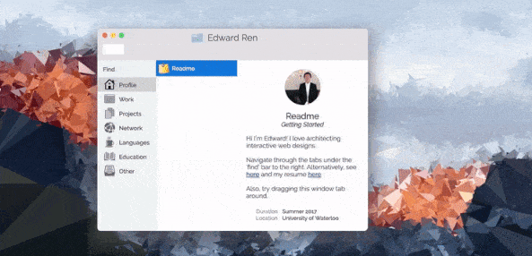
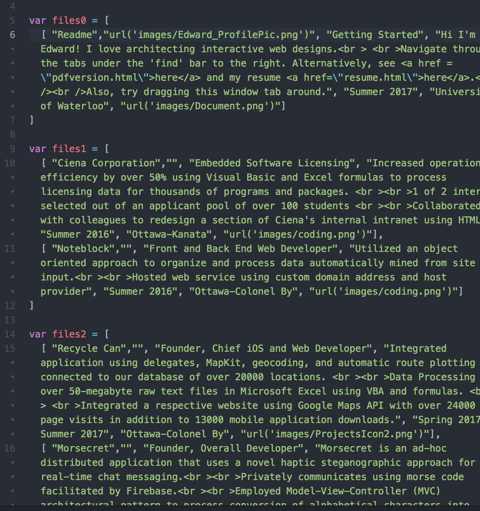
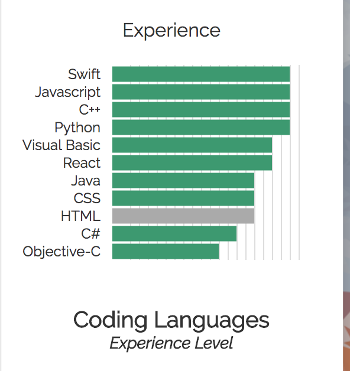
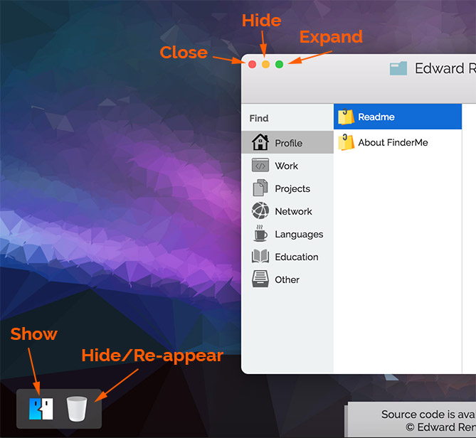
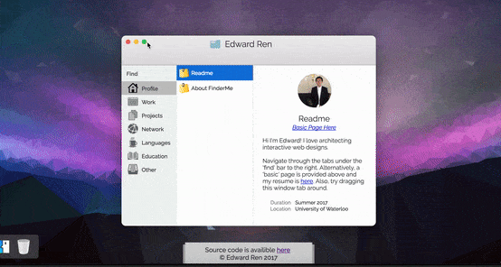
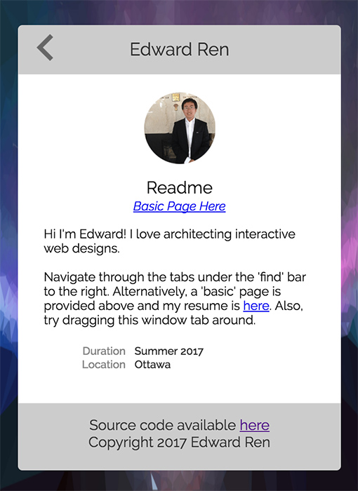
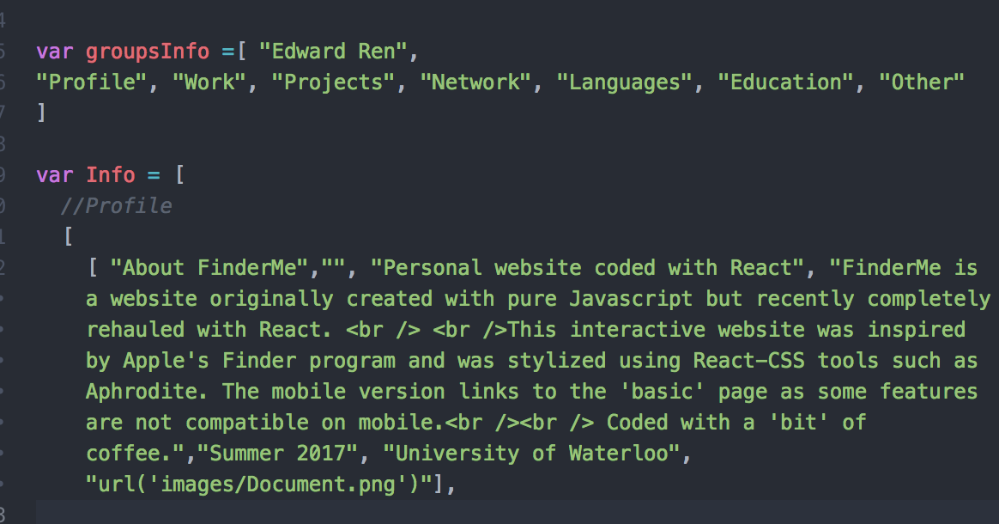
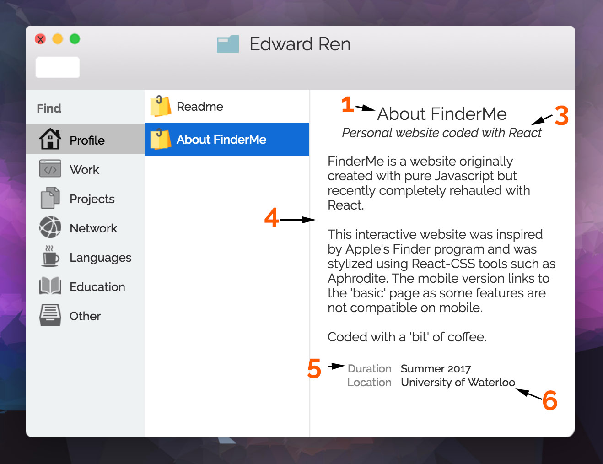
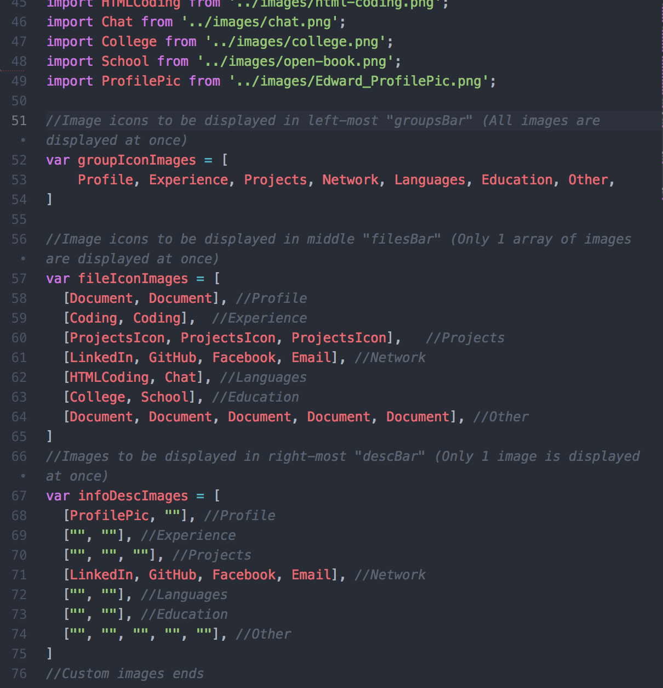
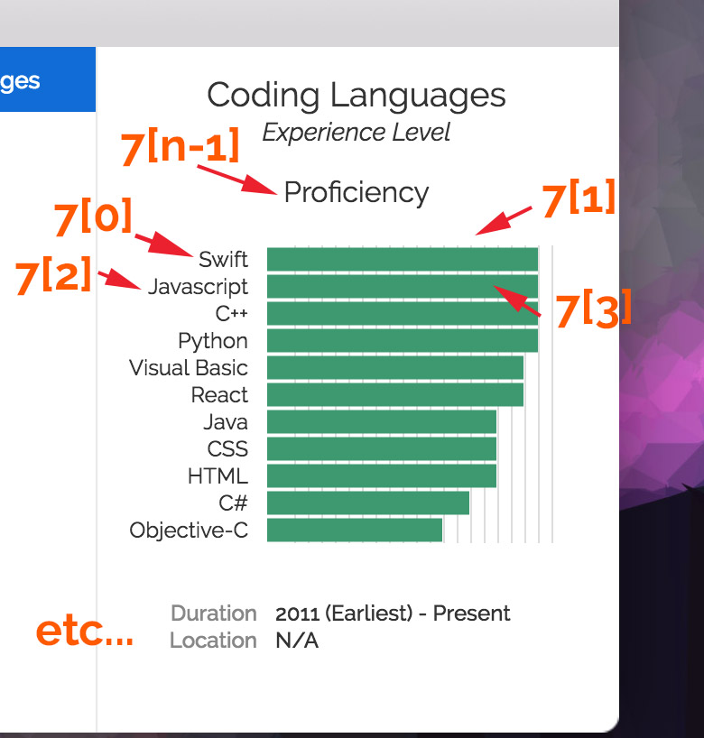

<!--
Copyright (c) 2017 by Edward Ren. All Rights Reserved.
 -->
[](https://travis-ci.org/EdwaRen/edwardren.me)
[](https://github.com/EdwaRen/FinderMe/releases/tag/v1.3.0)
[](https://github.com/Khan/aphrodite)
[](https://github.com/EdwaRen/FinderMe/blob/master/LICENSE.txt)


# Edwardren.me (FinderMe)

My personal website created primarily using React in conjunction with HTML/CSS. Pure CSS charts were also used to display proficiencies in different programming languages. If the site user does not wish to interact with default UI, there is an alternate 'basic' page for a dynamically generated webpage with all the info on the main index page. A mobile page for this site is available, however due to the lack of many features, it is rather minimalist.

<p align="center">
  
</p>

# Links

1. [Features](#features)
   * [Draggable](#draggable)
   * [Modularity](#modularity)
   * [Graphs](#graphs)
   * [Icon Controls](#icon-controls)<br />
2. [Testing](#testing)
3. [Documentation](#template)
   * [Importing Images](#importing-images)
   * [Charts](#using-custom-charts)
   * [SSL Certification](#ssl-certification)<br />
4. [Other Versions](#other-versions)
5. [Browser Compatibility](#browser-compatibility)
   * [Google Chrome](#google-chrome)
   * [Safari](#safari)
   * [Firefox](#firefox)
   * [Internet Explorer](#internet-explorer)
6. [License](#license)
7. [Contact](#contact)

# Features

This website was purposefully built to emulate the look of the 'Finder' program in Apple's MacBook computers. In doing so, there was a vision to construct a unique, friendly, and familiar website that does not implement the similar and overdone UI interfaces on many sites today. Some notable features are listed below.

## Draggable

Using React Draggable, a draggable main display was implemented so that the finder tab can be dragged around just like the real program itself. The principle display can be dragged anywhere. Clicking and holding anywhere on the main finder tab will drag it along. Though quite fun to play with on desktop computers, this drag functionality is not yet supported on mobile.

<p align="center">
  
</p>

## Modularity

Different sets of information can be easily added in or swapped out, new groups or files can be added with ease into the program. Through this modular programming, this website can also be used as a template for other purposes.

<p align="center">
  
</p>

## Graphs

There was considerable thought put into the decision to either code the languages chart myself or simply upload an image of a chart and call it a day. In the end, I decided the former was better as it provided superior modularity as well as providing more interactivity in the form of tooltips and reactive graph design. All the charts are created using pure HTML and CSS, so the end result is a static page which is supported by GitHub pages. A previous attempt to use Chart.js unfortunately came upon numerous setbacks.
<!--  In hindsight, I was just horrible at using npm :P-->

<p align="center">
  
</p>

## Icon Controls

The bottom left corner has two icons for controlling the main display. The first icon is to return the display to its starting position when clicked. This is necessary if the user has accidentally dragged the display out of page and reloads the main display without reloading the entire page.

The second icon is a garbage bin that can hide and re-appear the main display. Clicking it will only change the visibility of the main display, and its position will not change. When the main display is hidden, the first button can be clicked to reload the display.

<p align="center">
  
</p>

The red circle on the top-left of the main display can also be clicked to close itself. This will reset any group or file state to default. The finder display can be retrieved by clicking the finder icon or trash icon in the lower left corner.

The yellow circle can be clicked to minimize the tab. This also closes the display and does the same things as the red 'close' button but it saves the group and file state.

The green circle, or expand button, can be clicked to expand the finder display. This expands the display to fill 75% of the screen width and 90% of the screen height. Clicking this button again will shrink the display to its default size.Needless to say, this is not available on mobile and an alternative has been provided.


<p align="center">
  
</p>

## Mobile

A mobile version is also available although it lacks the draggable feature of the desktop version. The mobile version is activated by detecting the screen size of the user's screen on the initial page load. Hence resizing the screen will not activate the mobile page unless the page itself is also refreshed.

<p align="center">
  
</p>


# Testing

In the later stages of this project, it became apparent that GitHub Pages only supports static websites which led to some issues in testing. The main issue was that a fully functional website tested locally would have missing features when hosted by GitHub Pages (Also why there are ridiculous amount of commits on certain days). One critical issue was the use of react-router that caused issues with GitHub pages and which required a manual workaround.

# Using FinderMe As A Template

#### Clone
Simply go on terminal and clone this repository by typing in:
```
$ git clone https://github.com/EdwaRen/FinderMe
```

#### Installation
```
$ cd FinderMe
$ npm install
$ npm start
```


There, you can edit the information this program displays in the "src/Info/PersonalInfo.js" folder. The important place to look are the "groupsInfo" variable and "info" variables. The "groups" array is one dimensional and is responsible for the left-most tabs which are by default "Profile, Work, Projects, Network etc...". The first element in this array is the title shown at the very top of the finder display. Changing this variable will change the name of the groups on the groupBar (left-most) side of the finder display.

The "info" variable consist of a multi dimensional array that contains information to be displayed in both the middle (filesBar) and right-most (descBar) tabs. "Info" contains virtually all the customizable information. Info[i] gives the information with respect to the i-th group, so Info[0] gives the data necessary to display the 'Readme' page and the 'About FinderMe' page in an array. Going deeper, Info[i][j] tells us sufficient information necessary to display the descriptionaBar. For example, Info[0][0] gives us another array ['Readme', 'alt-text', 'subtitle', 'text', 'duration', 'location']. For example, to get the subtitle of the second file in the third group, we would use Info[2][1][2] (with the array starting at 0). This format can otherwise be shown like this Info[Group][File][Text Item]

<p align="center">
  
</p>

In Info, the first list contains details for all groups. Next, the list-in-a-list contains details for all files in ONE group. Lastly, the last list-in-a-list has a length of 7 and goes in detail for each file. This last-list (of length 7) has the following format

["Element Name", "Alternate Text (Unused)", "Subtitle", "Description", "Duration", "Location"]

Which correspond to the following graph labelled as such

["1", "2", "3", "4", "5", "6"] <br />
1 - Element Name <br />
2 - Alternate Text (For use in 'basic' page) <br />
3 - Subtitle <br />
4 - Description <br />
5 - Duration <br />
6 - Location <br />

<p align="center">
  
</p>

All the text can be set with HTML, so inputting
```
"Hello, my name is <b>Edward</b>"
```
will bold the word 'Edward', resulting in

"Hello, my name is **Edward**"


### Importing Images

Due to the nature of displaying images through React over traditional JavaScript, image displays are no longer customizable through "/src/Info/PersonalInfo.js" but instead it can be done at "/src/Components/FinderDisplay.jsx". The images section starts from line 23 to line 75 and all images need to be manually imported in the style of 'import IMAGE_NAME from ./SOURCE'. Once the images have been imported, the images must be loaded into three variables to display depending on location, 'groupIconImages, fileIconImages, infoDescImages'.

<p align="center">
  
</p>


### Using Custom Charts
While normally an information array (files variable) has a length of 6, extending the length will create a chart with the remaining values. These values must be placed in a SINGLE array on Info[i][j][6]. With alternating values between label and value. The last value will be the name of the chart. For example, including charts, the new "Info" variable will become the following:

["1", "2", "3", "4", "5", "6", **"7"**]<br />
1 - Element Name <br />
2 - Alternate text <br />
3 - Subtitle <br />
4 - Description <br />
5 - Duration <br />
6 - Location <br />
**7 - [Bar Name, Bar Length (out of 100), Bar Name 2, Bar Length 2, ... Chart Name]** <br />

<p align="center">
  
</p>

When the files array length is greater than 7, then the last value will be the title of the chart. In this version, only bar graphs are supported.
<br />

For more customizable chart options, you can mess with /css/styleGraph.css and #chartEnclosure in /css/HtmlStyles.css.

As a reminder, charts are only accessible when the "Info[i][j]" value is an array of strings, rather than a single string variable, otherwise no chart will be made.

### SSL Certification

FinderMe is currently viewable at edwardren.me which has an HTTPS certificate. If hosted on GitHub pages with a custom domain, any site can be HTTPS-certified by following the tutorial below,
https://hackernoon.com/set-up-ssl-on-github-pages-with-custom-domains-for-free-a576bdf51bc

# Other Versions

The current website is actually complete re-code of an almost identical website that can be found in the 'old-javascript-website' branch. The old version was done in basic JavaScript, it was deprecated due to its indiscriminate use of spaghetti code on innocent HTML pages. The current React supported webpage is much slimmer, faster, and efficient than it's predecessor. There is also a gh-pages branch that contains the static web page build of the master branch.

The gh-pages branch is regularly updated using the following.
```
$ npm run build
$ npm run deploy
```

# Browser Compatibility

FinderMe uses HTML 5 and CSS 3 so the latest version of your favorite browser is recommended.

### Google Chrome

The project is optimized for Google Chrome where most of the testing during development was done.

### Firefox
Fully functional on Firefox and in certain areas, the website works even smoother than Chrome. There are minor issues concerning slightly slower react-animations but these have an unperceptible effect on the actual website.

### Safari
Using Safari has a known issue with displaying box-shadows of non-rectangular divs. Otherwise, Safari works flawlessly with FinderMe.

### Internet Explorer?
Here is a link to download Chrome:
https://www.google.com/chrome/index.html

# License
Copyright (c) 2017 Edward Ren

This project and its use as a template is licensed under the GNU General Public License v3.0 (GNU GPL v3.0). Permissions of this strong copyleft license are conditioned on making available complete source code of licensed works and modifications, which include larger works using a licensed work, under the same license. For more specific information see [LICENSE](../blob/master/LICENSE)

Constituent icons used in this project are licensed through Creative Commons BY 3.0. Some authors are responsible for multiple icons.

Icon(s) made by Dave Gandy from www.flaticon.com, licensed by Creative Commons BY 3.0. <br >
Icon(s) made by Roundicon from www.flaticon.com, licensed by Creative Commons BY 3.0. <br >
Icon(s) made by Chanut is Industries from www.flaticon.com, licensed by Creative Commons BY 3.0. <br >
Icon(s) made by Freepik from www.flaticon.com, licensed by Creative Commons BY 3.0. <br >
Icon(s) made by Madebyoliver from www.flaticon.com, licensed by Creative Commons BY 3.0. <br >
Icon(s) made by Pixel Buddha from www.flaticon.com, licensed by Creative Commons BY 3.0. <br >
Icon(s) made by Icon Pond from www.flaticon.com, licensed by Creative Commons BY 3.0. <br >
Icon(s) made by Heydon from www.flaticon.com, licensed by Creative Commons BY 3.0. <br >
Icon(s) made by Lyola from www.flaticon.com, licensed by Creative Commons BY 3.0. <br >


Special thanks to my Keurig coffee machine for making this project possible.


# Contact

If you have any questions or inquiries concerning FinderMe or suggestions for future releases, send an email to Edward.ren.2013@gmail.com
